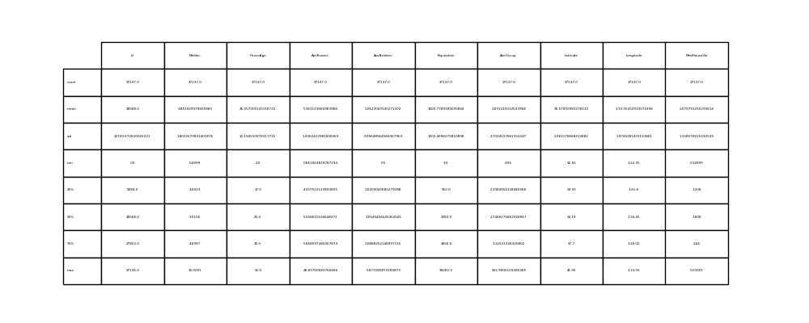
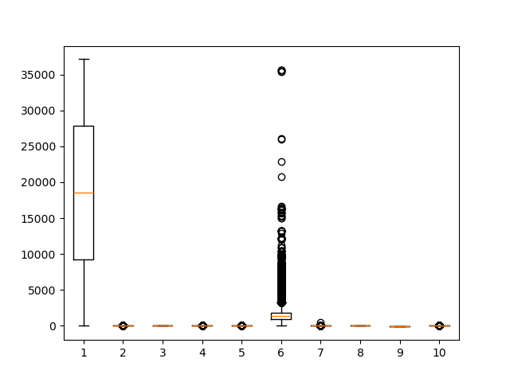
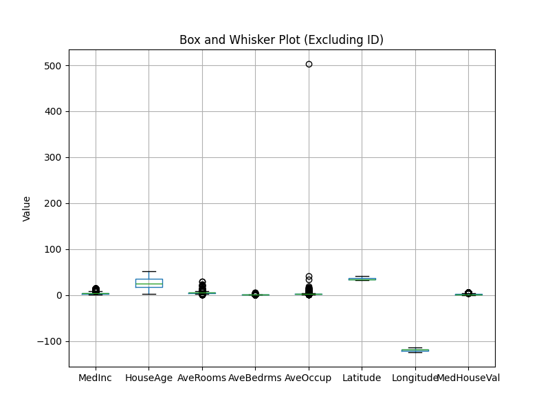

# This is a sample report of the <train.csv> containing Californian house prices

Here's some summary data:

Here is a box 'n whisker graph containing all the columns of a the data.

After some cleaning, it'll look like: 

